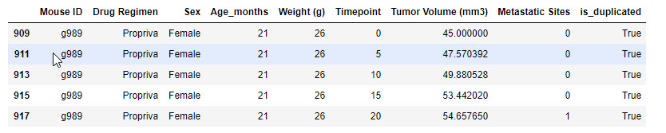
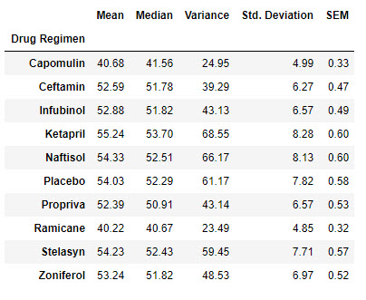

# Matplotlib-challenge

## Background

The following report presents the results of the analysis of 249 mice identified with SCC tumor growth. The animals were treated through a variety of drug regimens. Over the course of 45 days, tumor development was observed and measured. The purpose of this study was to compare the performance of Pymaceuticals' drug of interest, Capomulin, versus the other treatment regimens. 

## Study Results

## Detailed Analysis

### Data Quality
The 1893 test data points received were checked for quality. Mice with ID g989 was found to have duplicate measurements at the same time points. The 5 data points presented in the table below were discarded. 1888 test data points represent the clean dataset.

### Summary Statistics
The following table presents the statistics of the tumor volume in mm3 for each regimen.

