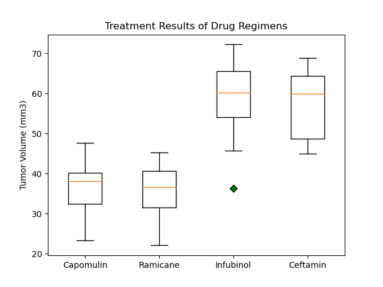
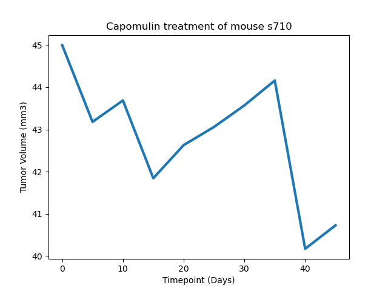

# Matplotlib-challenge

## Background

The following report presents the results of the analysis of 249 mice identified with SCC tumor growth. The animals were treated through a variety of drug regimens. Over the course of 45 days, tumor development was observed and measured. The purpose of this study was to compare the performance of Pymaceuticals' drug of interest, Capomulin, versus the other treatment regimens. 

## Study Results
* Capomulin and Ramicane have postive results on reducing the tumor volume in 45 days. It is assumed that both regimens have high rate of survival as mice count is maintained high during the study. Capomulin maintains the highest mice count during the study.
Assumption needs to be confirmed by the lab technicians performing the tests.
* Ceftamin, Infubinol, Ketapril, Naftisol, Placebo, Propriva, Stelasyn and Zoniferol did not have good treatment results because mice tumor volume increased during the study.
* There is a positive correlation between the Tumor volume and the weight of the mice, the heavier the mice the larger the tumor.

## Detailed Analysis

### Data Quality
The 1893 test data points received were checked for quality. Mice with ID g989 was found to have duplicate measurements at the same time points. The 5 data points presented in the table below were discarded. 1888 test data points represent the clean dataset.

### Summary Statistics
The following table presents the statistics of the tumor volume in mm3 for each regimen. Capomulin and Ramicane have the lower Tumor Volume median, below the starting Tumor volume of 45mm3. All the rest of the treatments have Tumor volume medians higher than 45mm3.

### Bar Plots
The following bar plot presents the number of mice per time point for each treatment.
It is noted that the number of mice reduces as the days pass. One assumption is that mice do not survive the tumor. The treatment of study Capomulin maintains the number of mice high accross the study, followed by Ramicane. The other treatments have count mice redutcion along the study.

### Pie Plots
The distribution by gender of the mice in the study is equivalent. Half of the mice are female and the other half are males.

### Quartiles, Outliers and Boxplots
Four regimens of interest were reviewed with more detail: Capomulin, Ramicane, Infubinol and Ceftamin.
The box plots below show the Tumor Volume in mm3 for the 4 regimens, for the last reading of the treatment of each mice. All the mice started with a Tumor Volume of 45mm3. Both Capomulin and Ramicane have reduced the tumor volume of the mice. Ramicane has a lower median of 36mm3 compared to 38mm3 from Capomulin. Both Infubinol and Ceftamin have mice tumor volume increase in their results.

### Line and Scatter Plots
Line plots are generated for any mice under Capomulin regimen, to check on Tumor volume over time. The plot below shows reduction of Tumor Volume over time for mouse y793.

A positive correlation was developed for mice weight against Tumor volume. The r^2 is 0.71 indicating a fair correlation: tumor volume increases as the weight of the mice increase.

